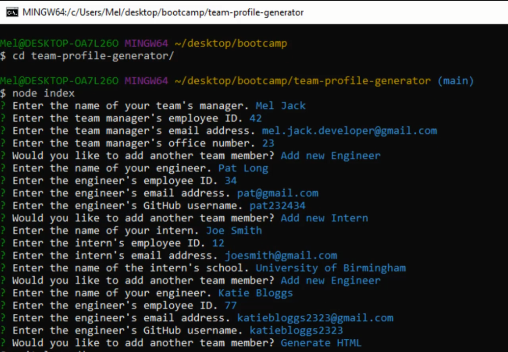
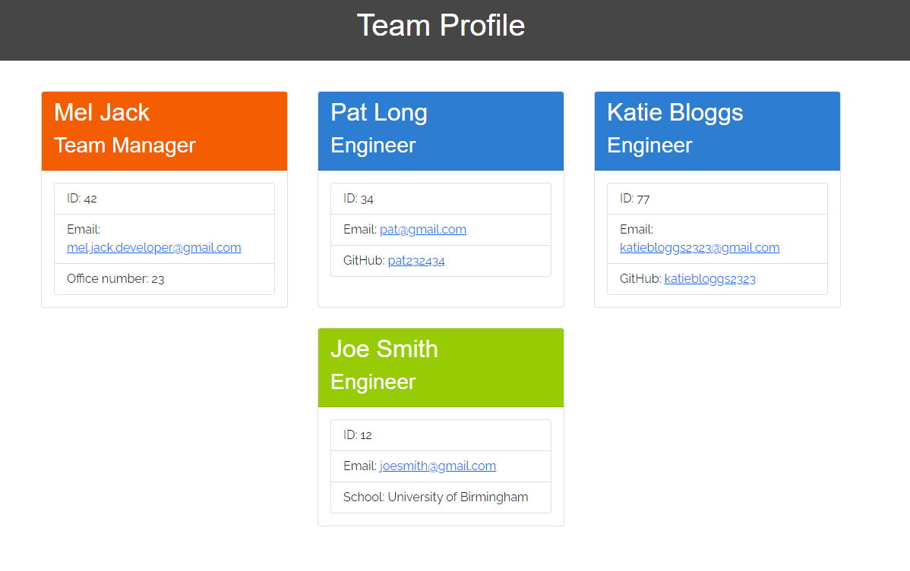
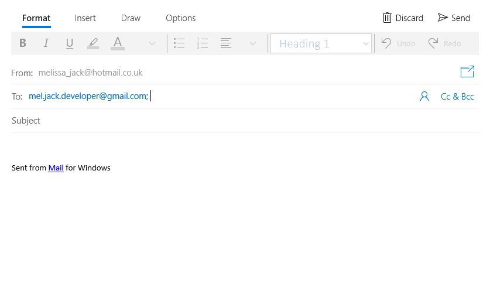
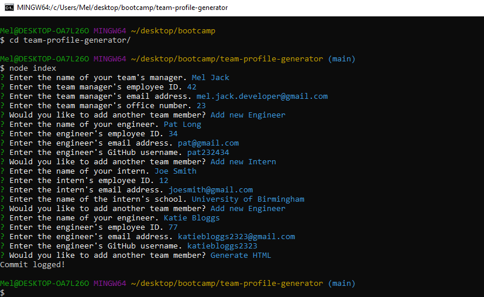

# team-profile-generator [](https://opensource.org/licenses/MIT)

## Table of Contents
* [Description](#description)
* [Installation](#installation)
* [Usage](#usage)
* [License](#license)
* [How to Contribute](#how-to-contribute)
* [Tests](#tests)
* [Credits](#credits)
* [Contact](#contact)

## Description
A team profile generator written in node.js allowing you to create a static HTML page with team details displayed in cards.

## Installation
Run the following command from the terminal: 

```npm i```

## Usage
Navigate to ```./team-profile-generator```

Run the following command from the terminal: 

```node index.js```

Answer each prompt in turn. Your html file will be stored in the ```./team-profile-generator/dist``` folder. A css file is also located there.

Click image below for a video tutorial:
[](https://drive.google.com/file/d/1yPEL9vANfyn6wwLGfYUXTc9gc4DzvMst/view)

More screenshots:




Example shown in [index.html](./dist/index.html)

## License 
This project is covered under the MIT License: [](https://opensource.org/licenses/MIT)

## How to Contribute
Fork the repository or contact me using the details shown below

## Tests
Tests are found in /tests folder. Run the tests using the following command from the terminal: 

```jest test```

## Credits 
Email validator function regex referenced from [UI.dev](https://ui.dev/validate-email-address-javascript/)

CSS Framework used: [Bootstrap](https://getbootstrap.com/)

## Contact
Please feel free to contact me through GitHub or email, using the following details: 

Email: mel.jack.developer@gmail.com

GitHub: [meljack1](https://github.com/meljack1/)
